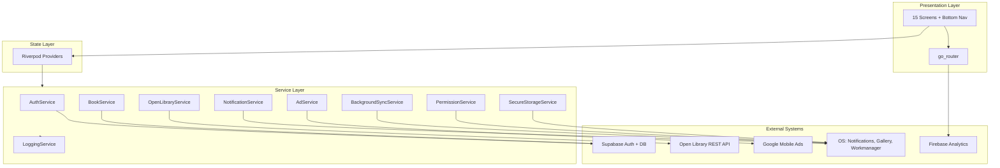
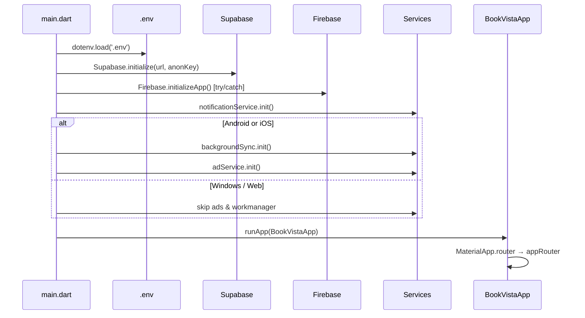
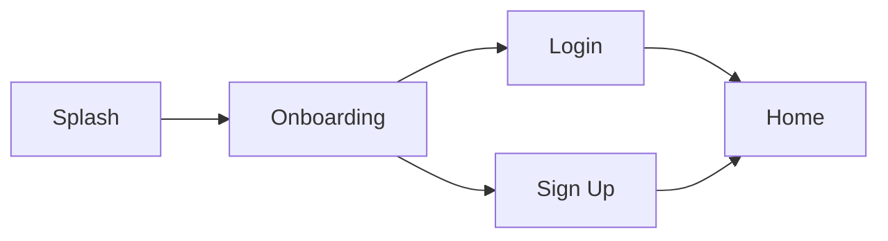
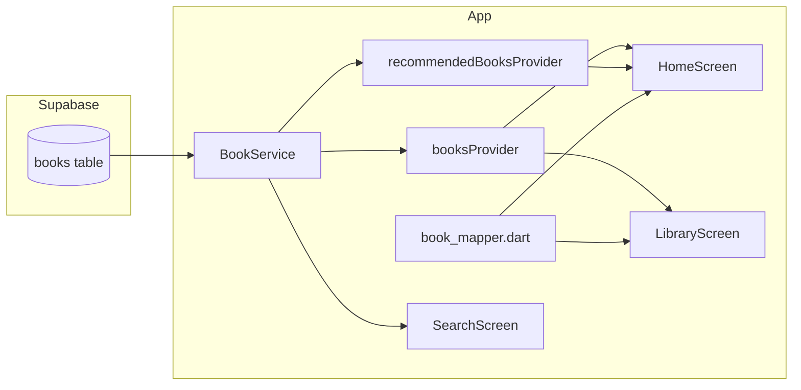
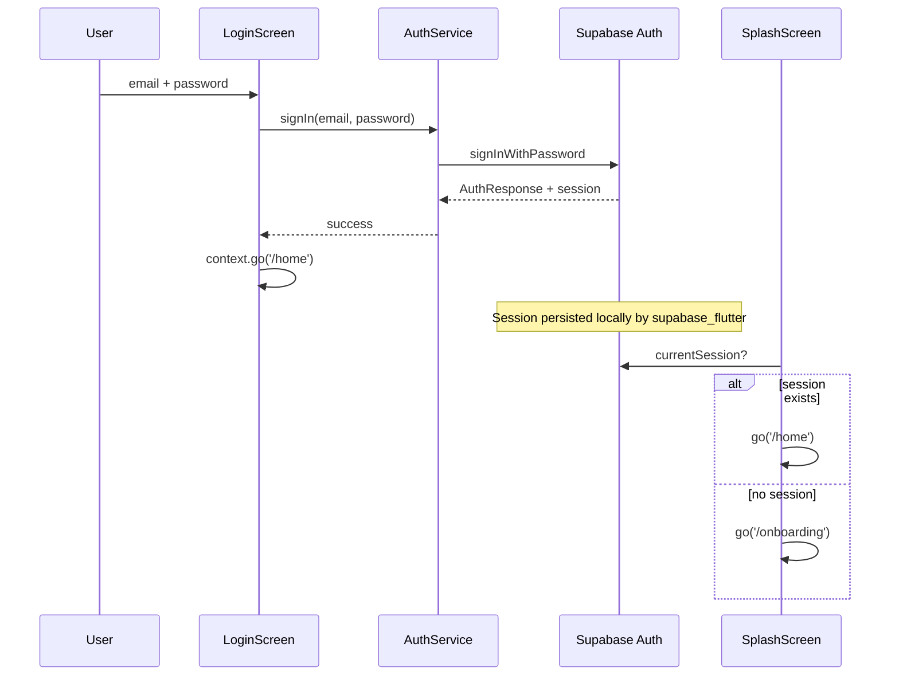
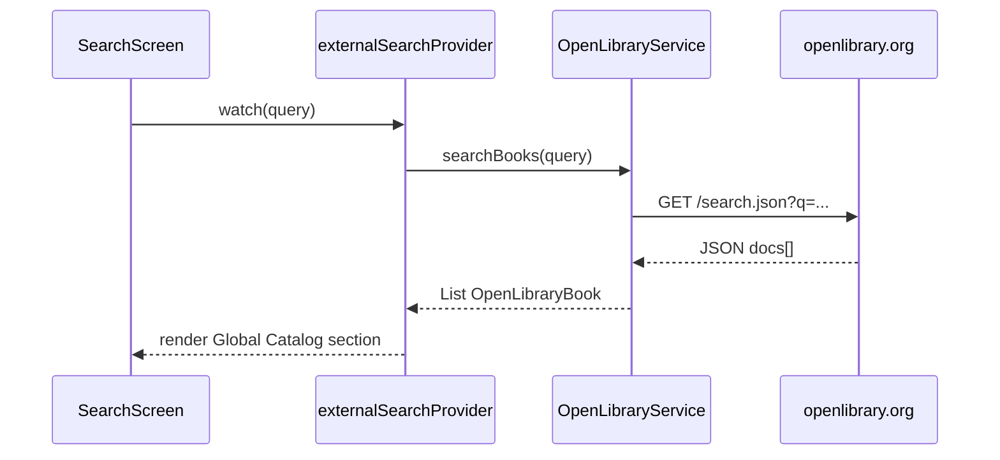
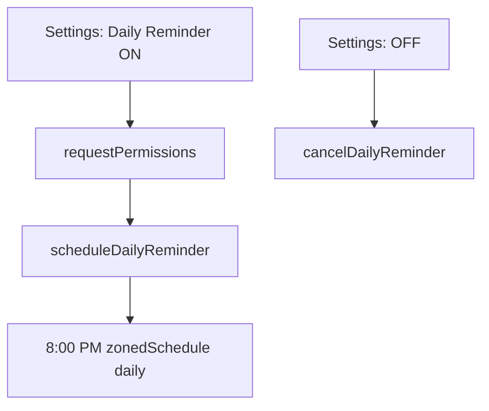
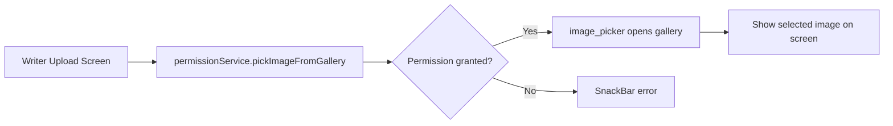

# BookVista — Project Report

This document explains **what BookVista does**, **how it is built**, and **how data flows** through the app. Use it to onboard a teammate or prepare a viva/demo presentation.

---

## 1. What is BookVista?

BookVista is a mobile-first Flutter app for:

- Browsing and reading books
- Searching a **local Supabase catalog** and a **global Open Library catalog**
- User authentication (sign up / log in)
- Writer features (upload cover image locally)
- Settings (typography, reminders)
- MAD rubric features: logging, notifications, ads, background tasks, secure storage, profiling-ready isolates

It is **not** a production bookstore — it is a **semester MAD project** that demonstrates Flutter, cloud backends, native integrations, and clean architecture.

---

## 2. High-level architecture



### Layer responsibilities

| Layer | Folder | Role |
|-------|--------|------|
| **UI** | `lib/features/**` | Screens, widgets, user input |
| **Core** | `lib/core/**` | Services, providers, theme, routing, utils |
| **Config** | `.env`, `firebase_options.dart` | API keys and Firebase platform config |
| **Entry** | `lib/main.dart` | Bootstraps Supabase, Firebase, services, then `runApp` |

---

## 3. Application startup flow



**Key file:** `lib/main.dart`

---

## 4. Navigation and user journey

### 4.1 First launch (no session)



1. **Splash** (`/`) — animated progress bar (~5 s)
2. Checks Supabase session:
   - **No session** → `/onboarding`
   - **Has session** → `/home` (skip login)
3. **Onboarding** → user taps Get Started → `/login`
4. **Login** — `AuthService.signIn` → success → `/home`
5. **Sign up** — `AuthService.signUp` → success → `/home`

**Note:** OTP and password-recovery screens were **removed** from this version.

### 4.2 Main app shell

Route `/home` loads `MainNavigationScreen` with **5 tabs**:

| Tab | Screen | Main purpose |
|-----|--------|----------------|
| Home | `HomeScreen` | Featured UI, Supabase book lists, banner ad (mobile) |
| Search | `SearchScreen` | Supabase + Open Library dual search |
| Library | `LibraryScreen` | User library list from Supabase |
| Activity | `ActivityScreen` | Reading activity UI |
| Profile | `ProfileScreen` | User info, sign out, links |

### 4.3 Secondary routes (pushed from tabs)

| Route | Screen |
|-------|--------|
| `/book-detail` | Book detail |
| `/reading` | Reader + isolate stats |
| `/bookmarks` | Saved bookmarks |
| `/settings` | App settings |
| `/writer-upload` | Pick cover image |
| `/author-profile` | Author profile |

**Router file:** `lib/core/navigation/app_router.dart`

---

## 5. Data flow — books

### 5.1 Where book data comes from



| Screen | Data source | Provider / service |
|--------|-------------|-------------------|
| Home — Recent Picks | Supabase | `recommendedBooksProvider` (limit 5) |
| Home — Top Hit Books | Supabase | `booksProvider` (all books) |
| Home — Hero carousel | Static UI card | Not from DB yet |
| Library — reading cards | Supabase | `booksProvider` |
| Search — Local Collection | Supabase | `bookService.searchBooks(query)` |
| Search — Global Catalog | Open Library API | `externalSearchProvider` |

### 5.2 Book row mapping

`lib/core/utils/book_mapper.dart` normalizes Supabase JSON:

| DB column | UI use |
|-----------|--------|
| `title` | Card title |
| `author` | Subtitle |
| `cover_url` | Network image (fallback if empty) |
| `progress` | Progress bar (0–1) |
| `rating` | Top hits rating |
| `genre` | Library tags |

---

## 6. Authentication flow (Supabase)



**Sign up** also stores metadata: `full_name`, `role` (Reader/Writer) in user `data`.

**Sign out:** Profile screen → `AuthService.signOut()`.

---

## 7. External REST API (Open Library)

**Not Firebase** — satisfies the “external REST API” rubric.



**File:** `lib/core/services/open_library_service.dart`  
**Timeout:** 10 seconds  
**Limit:** 7 results per query

---

## 8. Security features

### 8.1 Secure local storage
- Package: `flutter_secure_storage`
- Android: EncryptedSharedPreferences
- iOS: Keychain (`first_unlock`)
- Stores: daily reminder toggle, typography scale, etc. from Settings

### 8.2 Decryption demonstration (reading screen)
- User opens `/reading`
- Long chapter text is processed in a **background isolate** via `compute()`
- Function `parseBookTextStats()` counts words/chars and runs a simple Caesar cipher encode/decode
- UI shows a loading spinner, then stats — **UI never freezes**

This demonstrates **threading + encryption concept** for the MAD rubric; it is not full AES app-level encryption.

---

## 9. Notifications



- Package: `flutter_local_notifications` + `timezone`
- Channel: `daily_reminder_channel`
- Notification ID: `1001`
- Best demonstrated on **Android emulator/device**

---

## 10. Background tasks and threading

### 10.1 Foreground isolate (`compute`)
| Item | Detail |
|------|--------|
| File | `reading_screen.dart` |
| API | `compute(parseBookTextStats, chapterText)` |
| Purpose | CPU work off main UI thread |

### 10.2 Background periodic task (Workmanager)
| Item | Detail |
|------|--------|
| File | `background_sync_service.dart` |
| Frequency | Every 15 minutes (Android minimum) |
| Task name | `syncOfflineBooksTask` |
| Current behaviour | Mock delay + log (placeholder for real Supabase sync) |
| Platform | Android / iOS only |

---

## 11. Permissions and writer upload



**Files:** `permission_service.dart`, `writer_upload_screen.dart`

---

## 12. Monetization (ads)

- **Mobile only** (`isMobilePlatform` guard in `main.dart`)
- `AdService.init()` → `MobileAds.instance.initialize()`
- Test ad unit IDs (Google sample banners)
- `BookVistaBannerAd` widget on `HomeScreen`
- **Windows:** skipped — log says *"Skipping Workmanager and Mobile Ads on this platform"*

---

## 13. Logging and debugging

Every major service uses `LoggingService`:

```
💡 Initializing BookVista native services...
💡 Initializing NotificationService...
💡 Fetching from Open Library API: https://...
⛔ Error initializing Mobile Ads SDK  (only if wrong platform)
```

**File:** `lib/core/services/logging_service.dart`  
Run `flutter run` and watch the terminal for coloured structured logs.

---

## 14. Profiling (for MAD viva)

Profiling = measuring performance with **Flutter DevTools**.

### Steps (simple)

1. Run app: `flutter run --profile -d android` (or `-d windows` for practice)
2. Copy **DevTools URL** from terminal into Chrome
3. Open **Performance** tab → click **Record**
4. In the app: scroll Home, open Reading screen
5. Click **Stop** → screenshot the timeline
6. Write 3–5 sentences about frame times and isolate offload

Detailed guide: [docs/PROFILING_AND_ANDROID_DEMO.md](docs/PROFILING_AND_ANDROID_DEMO.md)

---

## 15. MAD rubrics — side-by-side comparison

| Rubric | Required by course | What we built | Demo tip |
|--------|-------------------|---------------|----------|
| Flutter Installation | Working Flutter project | Multi-platform, `flutter test` passes | Show `flutter doctor` |
| Complete GUI | Rich multi-screen UI | 15 screens, glassmorphism, bottom nav | Walk through Home → Reading → Settings |
| Firebase/Supabase | Cloud auth + data | Supabase auth + `books` table; Firebase Analytics | Log in live; show books loading |
| Security | Encryption/decryption | Secure storage + isolate cipher demo | Open Settings (secure prefs); Reading stats |
| Architecture | Clean structure | core/features + Riverpod | Show folder tree in IDE |
| REST API | Non-Firebase HTTP API | Open Library search | Search "dune" — show global results |
| Profiling | Performance analysis | DevTools-ready + `compute()` | Show Performance screenshot |
| Logging | Debug output | Logger service | Point at terminal logs |
| Notifications | Local alerts | 8 PM daily reminder | Toggle in Settings on Android |
| Background/Threading | Isolate + background service | `compute()` + Workmanager | Reading screen loader + log after 15 min |
| Permissions | Runtime permission | Gallery for writer upload | Writer upload → pick image |
| Ads | Monetization | Google test banner | Home screen on Android |

---

## 16. Environment and secrets

| File | Purpose |
|------|---------|
| `.env` | `SUPABASE_URL`, `SUPABASE_ANON_KEY` (gitignored) |
| `.env.example` | Template for teammates |
| `firebase_options.dart` | FlutterFire generated config |
| `android/app/google-services.json` | Firebase Android config |

`main.dart` fails fast if `.env` keys are missing.

---

## 17. Known limitations (be honest in viva)

1. Hero carousel on Home is **static**, not from Supabase.
2. Book detail / bookmarks / activity screens are **mostly UI** — not fully wired to DB.
3. Background sync is a **mock** — does not write to Supabase yet.
4. Writer upload picks an image locally — **no Supabase Storage upload** yet.
5. Windows desktop shows `accessibility_bridge` console noise — **harmless**.
6. Reading screen may show a tiny **Row overflow** warning on narrow widths — cosmetic only.
7. Full rubric demo (ads, Workmanager, permissions) needs **Android**.

---

## 18. Quick demo script (5 minutes)

1. **Splash** → onboarding → **login** with test account
2. **Home** → scroll Recent Picks / Top Hits (Supabase data)
3. **Search** → type a book → show Local + Open Library results
4. **Library** → Supabase book cards
5. **Reading** → wait for isolate stats panel
6. **Settings** → toggle daily reminder; tap "Gift a coffee" (Firebase event on mobile)
7. **Writer upload** → pick gallery image (Android)
8. **Home** → show banner ad (Android)
9. **Profile** → sign out → relaunch → splash goes to onboarding

---

## 19. Commands cheat sheet

```bash
# Setup
flutter pub get
copy .env.example .env

# Run
flutter run -d android
flutter run -d windows

# Test
flutter test

# Profile
flutter run --profile -d android

# Build APK
flutter build apk --debug
```

---

## 20. File reference index

| Concern | File |
|---------|------|
| App entry | `lib/main.dart` |
| Routes | `lib/core/navigation/app_router.dart` |
| Supabase | `lib/core/services/supabase_service.dart` |
| Providers | `lib/core/providers/service_providers.dart` |
| Book mapping | `lib/core/utils/book_mapper.dart` |
| Platform guards | `lib/core/utils/platform_utils.dart` |
| Open Library | `lib/core/services/open_library_service.dart` |
| Notifications | `lib/core/services/notification_service.dart` |
| Ads | `lib/core/services/ad_service.dart` |
| Background sync | `lib/core/services/background_sync_service.dart` |
| Permissions | `lib/core/services/permission_service.dart` |
| Secure storage | `lib/core/services/secure_storage_service.dart` |
| Logging | `lib/core/services/logging_service.dart` |
| Splash session | `lib/features/auth/screens/splash_screen.dart` |

---

*BookVista — MAD Semester Project Report*  
*Last updated to reflect: Supabase live books, `.env` config, splash session check, OTP/forgot-password removed, platform-aware mobile features.*
